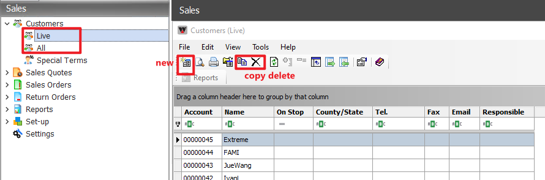
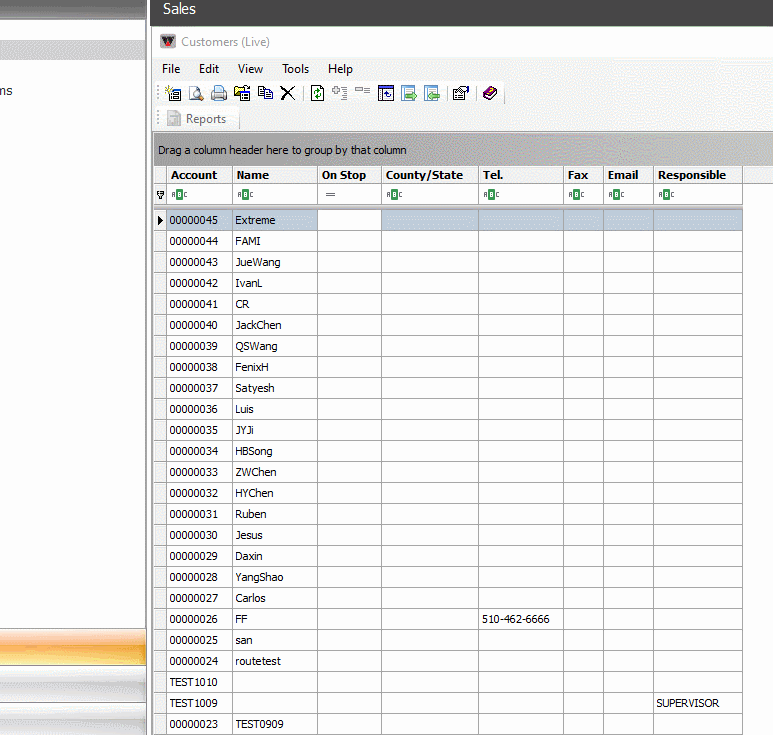
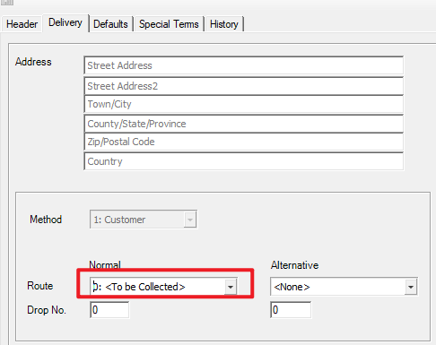
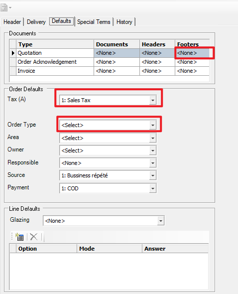

# Customers

---

## 界面

## new customer

### 1. 需要点击其他的客户名之后创建会自动分配account number 

### 2.可以提前给客户安排路线。暂时只设置了 North Route, South Route, Pick up, 第一个To be colllected 没有用

### 3.选择report footer,不能设置默认

#### 除了dealer外会需要选tax，和order type

