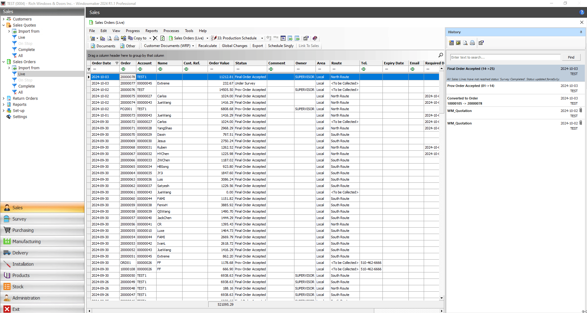
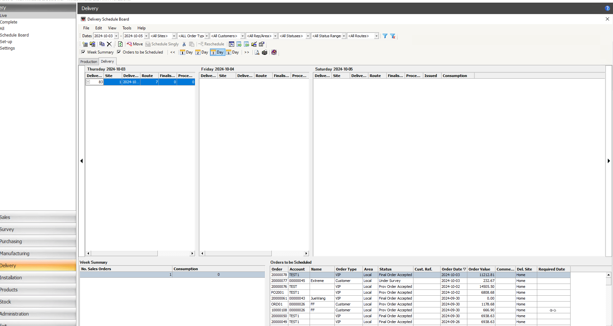
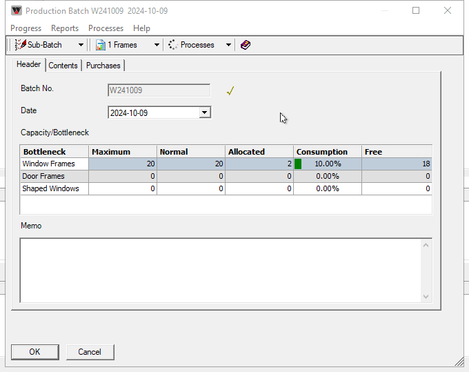
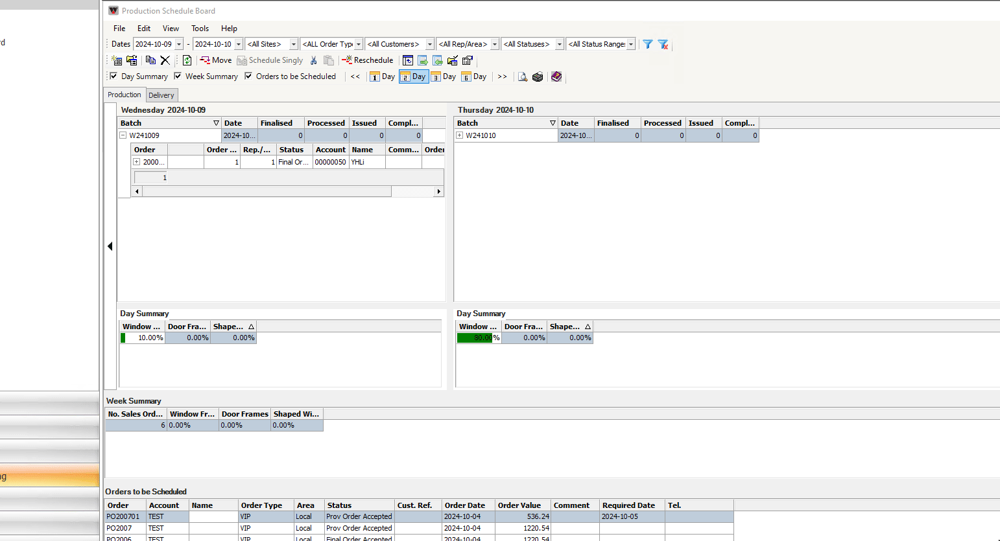
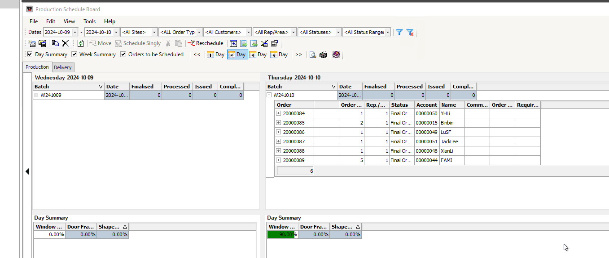
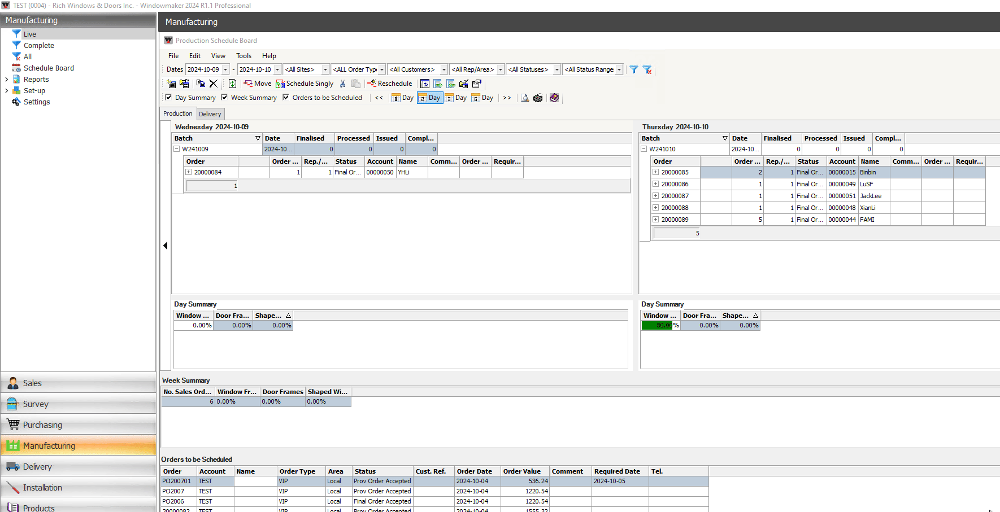

在下料之前我们需要先安排好路线和要求的时间

我们可以在order中看到时间，可以根据时间排序

  

 

创建delivery batch

只是创建好，而不schedule,我们在下料的batch中schedule的时候单子会自动进入这个delivery batch

 

创建production batch, schedule it

成功的话可以看到delivery batch number，路线和时间

失败的话，可能delivery batch没有创建，order没有设置routes和require date

当一个order中有门有窗，需要两种batch同时存在，否则schedule failed

 

开始下料,每次都需要点击subbatch和process(先subbatch),这是一个处理数据的过程,结束后在DCA文件夹中会有各种batch的切割数据,需要转成天宜的格式

 

generate production document我们需要几个转成excel格式的下料单

 

怎么查看一个batch是否下料,通过判断"√"

finalise的就代表完成下料

如果有报告不能生成，我们需要unfinalize,再进行一遍subbatch,process

 

create door batch

如果一个order里有门有窗，如果你拖动到window batch，那么它就会把order里的window放到那个window batch中， 门会找当日或临近的 door batch自动放进去, 如果没有door batch的话，会schedule failed

 

batch中取消某个单子

不选择删除，reschedule按钮不能用

 

move order to another batch

两种方法

 

batch中的单子需要unschedule之后才能修改required date和delivery route

显示的是unschele,说明order是schedule的， 此状态不能修改数据，会出现问题

 

一个完整的schedule,包schedule delivery,再Schedule production

 

结束后记得change status,便于分类

