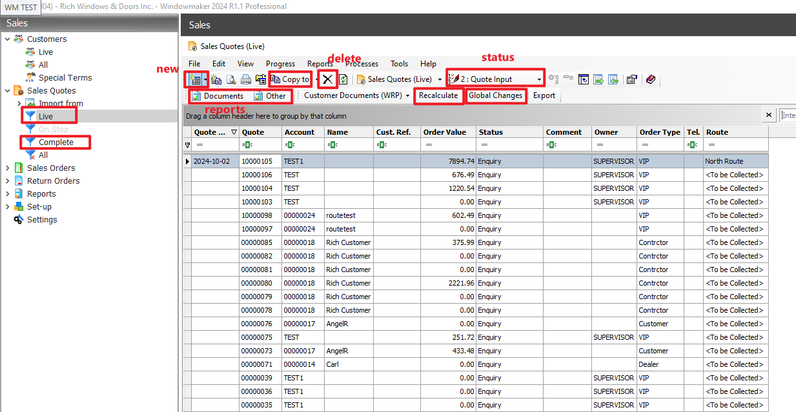
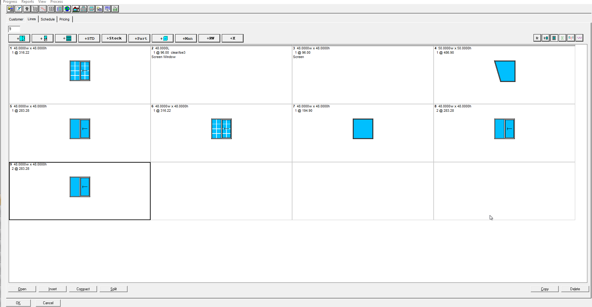
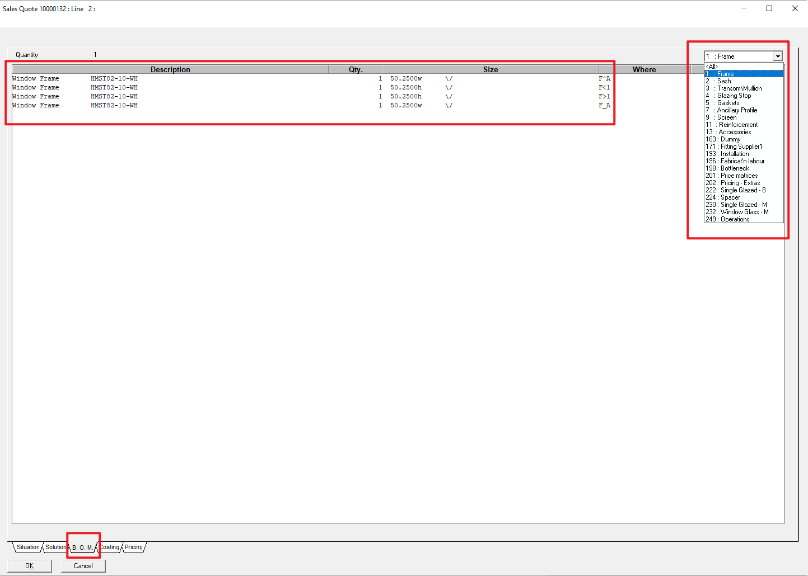
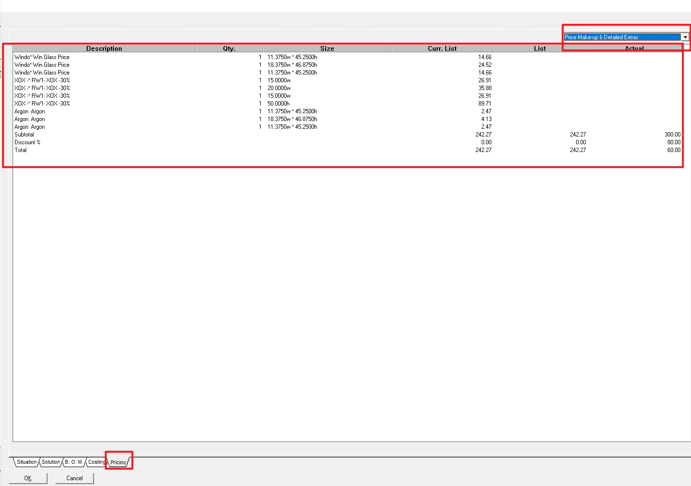
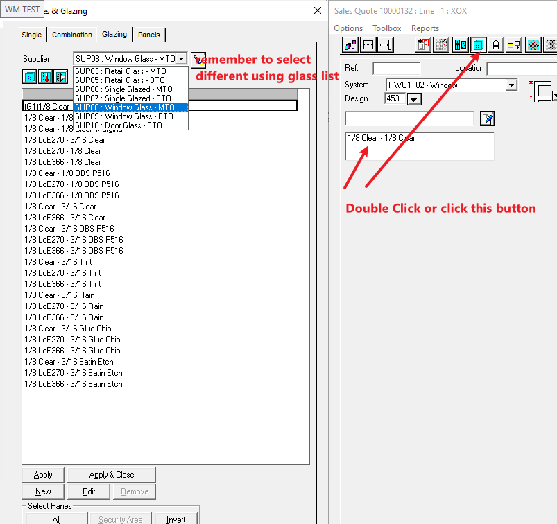
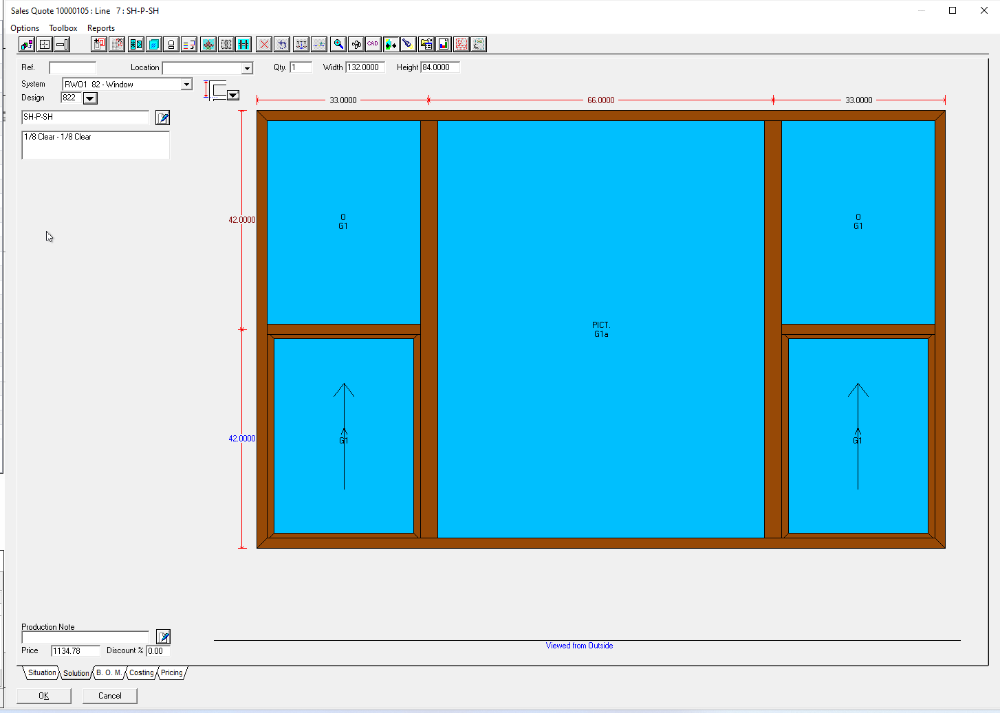
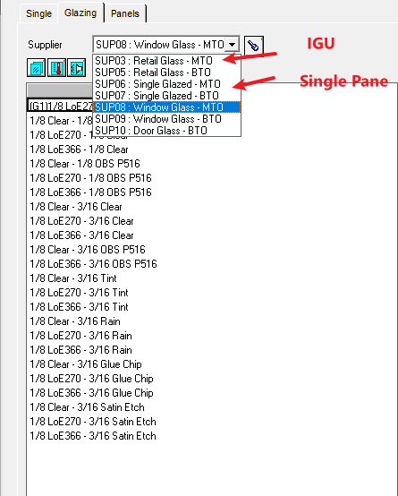
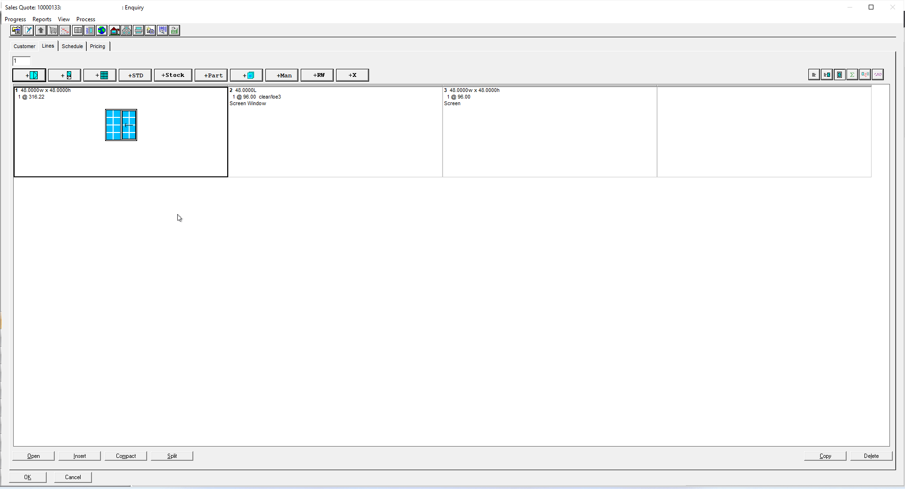
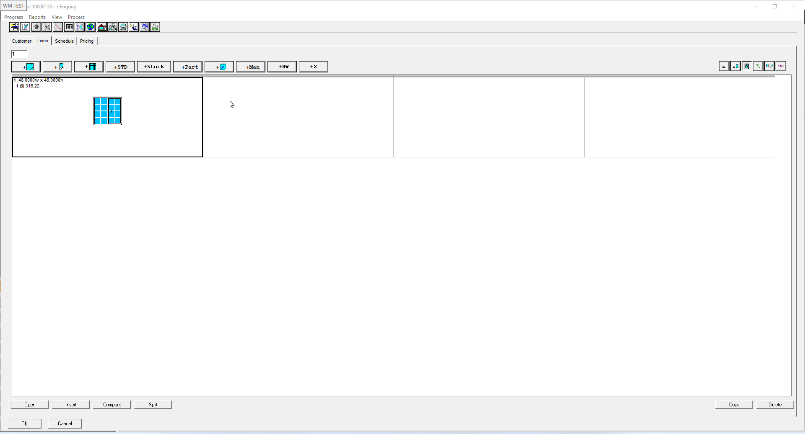

主界面

recalculate 会重新计算，每次我们修改之前的某些设置之后需要对单子点击这个按钮 

global change 可以整体改变一些选项，比如整体修改颜色 

  

 

new quote

1.chose customer,然后选到line之后就可以选择报价了

2.require date and route,这个可以在下料之前任何时间填    

3.这些添加的item都可以在quotation中显示出来

4.给quote给一个price type，不会变客户本身的price type

 

报价界面

 

新建item和复制删除

 

- 点某一个创建会延续它的风格

 

- 复制和删除

 

B.O.M 显示每个窗户材料详情

 

Pricing 显示每个item价格细节

 

Glass

- 门的玻璃中，以slider开头的是给XO/OX Patio Door 的玻璃，以Comb开头的是给其他门的玻璃

- 分make to order 和 buy to order，只有有一片包含1/8 clear,loe2,loe3,obs就是 make to order,其中需要订购的玻璃会自动分开到purchase order

- Retail Glass 是 IGU

- Single Glazed 是 Single Pane

## 给不同panel的玻璃选择玻璃类型

两种方法触发，双击玻璃类型选项，或者点击顶部玻璃选项按钮；
刚进去是全黑，是给所有panel选玻璃，再点击某一片玻璃，当那片玻璃变黑就可以选玻璃了

## 预览玻璃类型，尺寸变大，玻璃厚度会自动增加

 

IGU and Single Pane

 

多边形

## 多边形玻璃

## 多边形窗户

 

Grid

## 选择style和和删除不需要的grid

选中grid之后，ctrl+delete也可以删除

## 改变standard grid间距

## 修改两个方向的grid数量

## 修改marginal grid到frame的距离

## 自己创建grid

## grid信息会保存在玻璃里，所以以后需要删除grid

 

 

加parts

## 自定义part

 

显示单个窗户的下料信息

 

三种方式生成报价单

 

quote to order

### Status > 14. Prov Order Accepted

